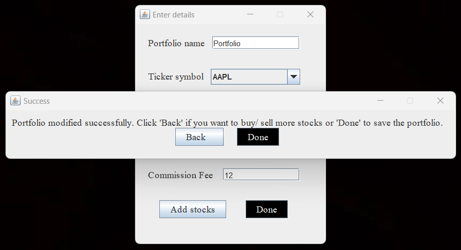
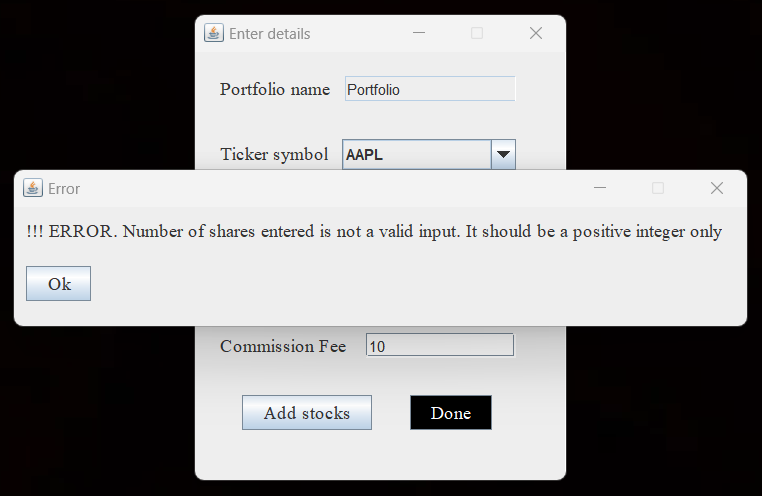

# SETUP-README.md - Stocks (Part 3) - Team 83135

The Stock application is implemented using MVC approach. Now, it has support for both text-based UI and Graphical UI . These UIs will receive inputs from the user and performs various operations on Flexible and Inflexible portfolios (Flexible and Inflexible). 

Below are the steps to run the Stock application :


## Installation

- The folder that contains the '.jar' and the supporting files will be available for download inside the res folder.
- Download the res folder into your local system.

#### Adding the dependencies to project

- The 2 external jar files for line chart generation is present in the res folder. We have to include these dependencies. To do so:

  1. In intelliJ, go to File -> Project Structure -> Modules. 
  2. Click on the '+' symbol and select 'JARs or directories'
     
  3. Select the two jar files (jcommon-1.9.9.jar and jfreechart-1.0.1.jar), and click 'OK'
     
  4. Select them and click 'Apply' and then 'OK'
     

#### Running the file from command-line (Terminal on Mac)

- Step 1: Open Terminal
- Step 2: Enter the following command (Note: You can also open the command-line pointing to the file. Right click on the folder and choose "Open with Terminal")

```bash
  cd <local_path_to_the_folder_containing_jar>
```
    
- Step 3: Run the following command (Before that, make sure that the '.jar' file is present inside the downloaded res folder)

```bash
  java -jar A6.jar
```

- Once the file ran successfully, you will see the list of options popping up on the command prompt:
```bash
Choose UI : 
1. Text Based UI
2. GUI Based UI 
Enter choice :  
```
## Navigating through the Text-based UI

- On selecting "1" for the above menu you will be redirected to the text based menu UI as follows:
```bash
Welcome to the Stock Application
-----------------------
1. Create/ Fetch inflexible portfolio (Commission fee : $10 per transaction)
2. Create/ Fetch flexible portfolio (Commission fee : $10 per transaction)
3. Quit
-----------------------
Enter Choice : 
```
Choosing the choices from above will take us to the next section - Creating Flexible or Inflexible (option 1 or 2 )

#### Section 1. Creating a new Flexible Portfolio

Here, we will run through the steps in creating two Portfolios A and B. Portfolio A will have 3 values of stocks and Portfolio B will have 2 values of stocks.
- Step 1.1: You will see the sub menu for a Flexible portfolio as follows:

```bash

-----------FLEXIBLE PORTFOLIO------------
1. Create new flexible portfolio (Commission fee : $10 per transaction)
2. Modify existing portfolio (Commission fee : $10 per transaction)
3. Upload existing portfolio file
4. Examine current composition for a portfolio
5. Cost Basis
6. Get total value of the portfolio.
7. Get performance graph.
8. Quit
-----------------------
Enter Choice : 
```

- Step 1.2: Input the value "1" under "Enter Choice"

```bash 
Enter Choice :
```

- Step 1.3: We have pre-loaded the 'portfoliosFlexible.xml' file with 2 portfolios - "College" and "Savings". You can input a portfolio name other than these values for creating  (Modifying/updating an existing portfolio is allowed for the 'Flexible portfolio only')

```bash
Your new portfolio will be created now. 
Enter Portfolio Name : 
```

You will receive an error if an existing portfolio name is entered


```bash
!!! ERROR : Portfolio name already exists. If you want to modify an existing portfolio, please select option 2 from the main menu. 
 Press 'Y' if you want to create a new portfolio or 'N' if you want to go back to the main menu :
 ```

- Step 1.4: Enter a valid Ticker symbol (Valid symbols include "AAPL", "AMZN", "GOOG", "MSFT", "TSLA", "BAC", "BRK", "HD", "JNJ", "JPM",
              "LLY", "MA", "NVDA", "PFE", "PG", "TSM", "UNH", "V", "WMT", "XOM")

```bash
Enter Ticker Symbol : 
```
You will receive an error if Ticker symbol is not in the above list

```bash
!!! ERROR : Ticker Symbol should be from the below list only 
(AAPL, AMZN, GOOG, MSFT, TSLA, BAC, BRK, HD, JNJ, JPM, LLY, MA, NVDA, PFE, PG, TSM, UNH, V, WMT, XOM)
```

- Step 1.5: Enter the number of shares here (decimal or other formats than integer not possible)

```bash
Enter number of shares : 
```
- Step 1.6: Enter the date bought here (incorrect formats other than the specified are not accepted)

```bash
Enter the date (yyyy-MM-dd) for purchasing: 
```
- Step 1.7: For creating 2 more stocks inside this Portfolio, Enter "Y" and repeat steps 1.4-1.6

```bash
Stock details added and saved successfully. Do you want to buy more stocks? (Y/N) : 
```
- Step 1.8: Once stocks are added, you can add a second portfolio. Enter "Y" and repeat steps 1.3-1.7

```bash
Portfolio created and saved successfully. Do you want to create more portfolios? (Y/N) 
```
- Step 1.9: The menu will be displayed once all the inputs are given and "N" was entered in steps 1.7-1.8. Enter "5" in the "Enter choice" to quit the application. Note that this will exit the application 

#### Section 2. Creating a new Inflexible Portfolio

Here, we will run through the steps in creating two Portfolios A and B. Portfolio A will have 3 values of stocks and Portfolio B will have 2 values of stocks.
- Step 2.1: You will see the sub menu for an Inflexible portfolio as follows:

```bash
------------INFLEXIBLE PORTFOLIO -----------
1. Create new inflexible portfolio
2. Upload existing portfolio file
3. Examine current composition for a portfolio
4. Get total value of the portfolio.
5. Quit
-----------------------
Enter Choice : 
```
- Step 2.2: Input the value "1" under "Enter Choice"

```bash 
Enter Choice :
```

- Step 2.3: We have pre-loaded the 'portfoliosInflexible.xml' file with 2 portfolios - "College" and "Savings". You can input a portfolio name other than these values (Modifying/updating an existing portfolio is now allowed for the 'Flexible portfolio only')

```bash
Your new portfolio will be created now. A commission fee of $10 will be charged per stock purchase.
Enter Portfolio Name : 
```

You will receive an error if an existing portfolio name is entered

```bash
!!! ERROR : Portfolio name already exists. You cannot modify an existing portfolio as you chose to create an inflexible portfolio. 
 Press 'Y' if you want to create a new portfolio or 'N' if you want to go back to the main menu :
 ```

- Step 2.4: Rest of the steps for ticker symbol, number of shares (you will not be asked for dates as in Section 1) will be same as in section 1.


#### Section 3. Uploading a new Flexible/Inflexible Portfolio

- Step 3.1: From the menu, input the value corresponding menu serial number under "Enter Choice". For Inflexible Portfolio its "2" and for Flexible Portfolio its "3"

```bash 
Enter Choice :
```

- Step 3.2: Enter the path that contains the xml file (from your local system)

```bash
Enter the file path you want to upload : 
```

Once the file upload is successful, you will receive a message as below

```bash
File upload successful, please proceed
```

And when the file upload is not successful, you will receive an error message

```bash
!!! ERROR : Invalid File path provided. Please provide valid path
```

#### Section 4. Examining the composition for a Portfolio

- Step 4.1: At the menu , input the value "3" under "Enter Choice" for Inflexible portfolio and "4" for Flexible Portfolio

```bash 
Enter Choice :
```

- Step 4.2: Enter a valid portfolio name that is available in the XML file (For example: "College")

```bash
Enter the portfolio name whose composition you want: 
```

- Step 4.3: Date would be asked only in case of flexible portfolio. Enter a valid date (incorrect date formats are not accepted)

```bash
Enter the date (yyyy-MM-dd) for composition: 
```

You will receive an output like this

```bash
* Portfolio Name : College
* Ticker Symbol: AAPL, Number of Shares: 30
* Ticker Symbol: AMZN, Number of Shares: 22
```
And you will be thrown an error when portfolio name that does not exist is passed

```bash
!!! ERROR : Portfolio name does not exist. Please enter a valid portfolio name.
```

And asked for more composition

- Step 4.4: You can check composition for more values by inputting "Y" or stop it here with a "N"

```bash
Do you want to view compositions of other portfolios? (Y/N) : 
```

#### Section 5. Total price for a Portfolio

- Step 5.1: Input the value "6" for Flexible portfolio

```bash 
Enter Choice :
```

- Step 5.2: You will be asked to input the portfolio name

```bash
Enter the portfolio name whose total price you want :
```

And you will be thrown an error when portfolio name that does not exist is passed

```bash
!!! ERROR : Portfolio name does not exist. Please enter a valid portfolio name.
```

- Step 5.3: Enter the date in the specified format 

```bash
Enter the date (yyyy-MM-dd) for total: 
```
And output will be displayed. Total value will be based on the stock price for that particular date (from the csv)

```bash
Total value of 'College' portfolio as on '2021-05-06' is = 76632.34
```

And for invalid dates (dates before the period of purchase), the total will be as follows

```bash
Total value of 'College' portfolio as on '2021-05-31'is = 0.0
```

- Step 5.4: You can check composition for more values by inputting "Y" or stop it here with a "N"

```bash
Do you want to view total of other portfolios? (Y/N) :
```

#### Section 6. Cost Basis for a Portfolio

- Step 6.1: This option will be available only for flexible portfolio. Select "5" from the menu.

```bash 
Enter Choice :
```

- Step 6.2: You will be asked to input the portfolio name

```bash
Enter the portfolio name whose cost basis you want :
```

And you will be thrown an error when portfolio name that does not exist is passed

```bash
!!! ERROR : Portfolio name does not exist. Please enter a valid portfolio name.
```

- Step 6.3: Enter the date in the specified format

```bash
Enter the date (yyyy-MM-dd) for cost basis: 
```
And output will be displayed. Cost basis will be based on the stock price on the bought date.

```bash
Cost Basis of 'College' portfolio as on '2021-05-06' is = 73425.2
```

And for invalid dates (dates before the period of purchase), the total will be as follows

```bash
Cost Basis of 'College' portfolio as on '2021-05-31' is = 0.0
```

- Step 6.4: You can check cost basis for more values by inputting "Y" or stop it here with a "N"

```bash
Do you want to view cost basis of other portfolios? (Y/N) :
```


#### Section 7. Performance Graph - Analysis for a Portfolio

- Step 7.1: This option will be available only for flexible portfolio. Input the value "7"

```bash 
Enter Choice :
```

- Step 7.2: You will be asked to input the portfolio name

```bash
Enter the portfolio name whose performance graph you want :
```

And you will be thrown an error when portfolio name that does not exist is passed

```bash
!!! ERROR : Portfolio name does not exist. Please enter a valid portfolio name.
```

- Step 7.3: Enter the  start and end dates in the specified format

```bash
Enter the start date (yyyy-MM-dd) : 
```

```bash
Enter the end date (yyyy-MM-dd) : 
```

And output will be displayed. Performance graph will be based on the stock price for that specified range on a certain scale. To note: some values will be empty (no "*"), if no stocks are owned in that interval.

```bash
Performance of portfolio pfNameGraph from 2021-03-21 to 2021-06-01

2021-03-21 : *
2021-03-26 : *
2021-03-31 : *
2021-04-05 : ******************************
2021-04-10 : ********************************
2021-04-15 : *************
2021-04-20 : **************************
2021-04-25 : ***********************
2021-04-30 : ********************************
2021-05-05 : *********************
2021-05-10 : ******************************
2021-05-15 : ****************
2021-05-20 : *******************************
2021-05-25 : **************************
2021-05-30 : *******************************

Scale: * = $2399
```

- Step 7.4: You can check the performance graph for more values by inputting "Y" or stop it here with a "N"

```bash
Do you want to view performance graph of other portfolios? (Y/N) :
```

#### Section 8. Modifying a portfolio

- Step 8.1: This feature will be available only if the user selects the flexible portfolio option from main menu. Select option "2" here.

```bash 
Enter Choice :
```

- Step 8.2: Then you will be asked to enter the portfolio name to be modified

```bash
Enter the portfolio name you want to modify : 
```

And you will be thrown an error when portfolio name that does not exist is passed

```bash
!!! ERROR : Portfolio name does not exist. Please enter a valid portfolio name.
```

- Step 8.3: The below message will be displayed, mentioning the commission fee for each modification. User has to enter 'P' or 'S' for purchasing or selling respectively.

```bash
Your portfolio will now be modified. A commission fee of $10 will be charged everytime you purchase or sell. 
Do you want to purchase more stocks or sell them? (Enter 'P' for purchasing or 'S' for selling) : 
```

- Step 8.4: If entered 'P' user will be asked for ticker symbol, number of shares and date of purchase

```bash
Enter Ticker Symbol : AAPL
Enter number of shares : 10
Enter the date (yyyy-MM-dd) for purchasing: 2022-03-04
```

For invalid inputs similar errors and before will be thrown and the user will have to re-enter the data.
Upon successful transaction the below message will be displayed.
```bash
Stock details added and saved successfully. Do you want to buy more stocks? (Y/N) : 
```

- Step 8.5: If entered 'S' was entered (for selling) user will be asked for ticker symbol, number of shares and date of selling

```bash
Enter Ticker Symbol : AAPL
Enter number of shares : 10
Enter the date (yyyy-MM-dd) for purchasing: 2022-03-04
```

- Step 8.6: If the user enters and invalid selling date or number of shares, then the below prompt will pop up. Invalid date includes date on which the user doesn't own any stocks and invalid number of shares means if the user is trying to sell more shares than he owns on that date.

```bash
!!! ERROR : You are trying to sell more shares of this stock than you own. 
```
Upon successful transaction the below message will be displayed. Inputting "Y" or "N" will navigate you accordingly.
```bash
Stock details added and saved successfully. Do you want to buy more stocks? (Y/N) : 
```

- Step 8.7: You can modify your portfolio again by inputting "Y" or stop it here with a "N"

```bash
Portfolio updated successfully. Do you want to purchase or sell more stocks? (Y/N) : 
```

## Navigating through the Graphical UI

On selecting "2" for the above menu you will be redirected to the graphical UI as follows:


#### Section 1. Creating a new Flexible Portfolio
- Step 1.1: On choosing '1' from the main menu, you will be given the options to create a flexible portfolio as below: 


- Step 1.2: On choosing '1' from the above menu, you can create flexible portfolio by inputting values into the menu as below:


On successful portfolio creation, you will be prompted as



And on error, you will be prompted as 



- Step 1.3: On choosing '2' from the portfolio creation menu, you can create a flexible portfolio using investment strategy (done button will be disabled initially until the user has inputted the date field) as below:


- Step 1.4: On choosing '3' from the portfolio creation menu, you can create a flexible portfolio using Dollar cost averaging (done button will be disabled initially until the user has inputted the interval) as below:


#### Section 2. Modifying an existing Flexible Portfolio

- Step 2.1: On choosing '2' from the main menu, you will be given the options to modify an existing flexible portfolio as below:


- Step 2.2: On choosing '1' from the above menu, you can modify the existing flexible portfolio by inputting values as below:


On successful portfolio modification, you will be prompted as


And on error, you will be prompted as 


- Step 2.3: Investment strategic modification of a flexible portfolio is same as creation using investment strategy

- Step 2.4: Dollar cost average modification of a flexible portfolio is same as creation using dollar cost averaging

#### Section 3. Upload a Flexible Portfolio

- Step 3.1: On choosing '3' from the main menu, you will be given the option to upload a portfolio as below:


On successful upload, you will be prompted as


And on error, you will be prompted as


#### Section 4. Get Composition of a Flexible Portfolio

- Step 4.1: On choosing '4' from the main menu, you will be able to get composition of a Flexible portfolio as below:


- Step 4.2: On inputting values, the user can retrieve the composition for the required portfolio


#### Section 5. Get Cost Basis of a Flexible Portfolio

- Step 5.1: On choosing '5' from the main menu, you will be able to get the cost basis of a Flexible portfolio just like composition
- Step 5.2: On inputting values, the user can retrieve the cost basis for the required portfolio


#### Section 6. Get Value of a Flexible Portfolio

- Step 6.1: On choosing '6' from the main menu, you will be able to get the value of a Flexible portfolio just like composition
- Step 6.2: On inputting values, the user can retrieve the value for the required portfolio just like composition

#### Section 7. View Performance Graph of a Flexible Portfolio 

- Step 7.1: On choosing '7' from the main menu, you will be able to view the performance graph of a Flexible portfolio over a time frame


## Team members

- [@rahulchandak]
- [@kiranshatiya](https://github.com/kiran-shatiya-5)
## Support

For support or further queries, email or message us on Teams.

